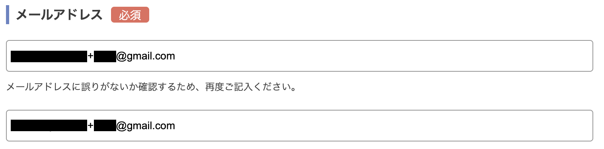
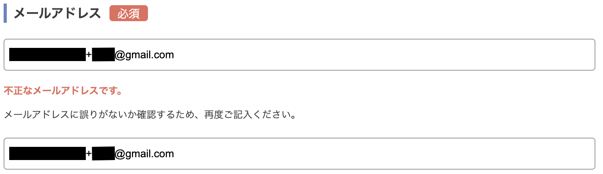
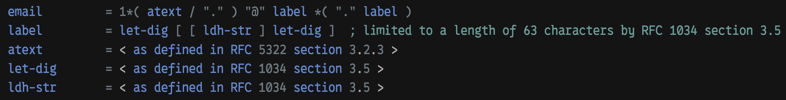
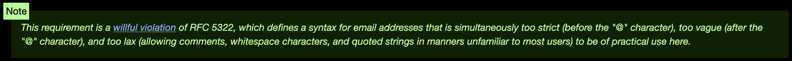
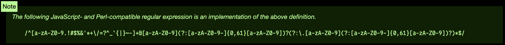

<!-- _class: cover -->

# やはりお前らのメールアドレスバリデーションは間違っている

 ゆん

---

<!-- _class: divider -->
# 前提

---

# Gmailにはメールアドレスのエイリアス機能がある

```
// 通常のメールアドレス
test@example.com

// エイリアスを付けたメールアドレス
// test@example.comと同じように受信できる
test+alias@example.com
```

---
<!-- _class: divider -->

# サービスに登録する時にエイリアスをつけると、漏洩した際に漏洩元が分かってうれしい(うれしくはない)

---
<!-- _class: divider -->

# 某社のお客様相談室に連絡したときの話

---
<!-- _class: image-only -->


---

<!-- _class: image-only -->

<!-- TODO: 画像を修正 -->

---
<!-- _class: divider -->

# 何が起きたか？

---
<!-- _class: divider -->

# クレームが1行増えることになった

---

# メールアドレスの定義

- RFC5321
  - SMTPプロトコルを定義
- RFC5322
  - メッセージフォーマットを定義

DNS解決可能な形式を定義しているRFC5321の方が厳格
RFC5322はヘッダを解釈するためにかなり緩い

---

# RFC5321

`Local-part "@" ( Domain / address-literal )`

- 全長256文字まで
  - `<user@example.com>`のような形式を含むため、実質254文字まで

---

# local-part

- dot-stringかquoted-string(後述)
- 合計64文字まで

---

# Dot-string

- atextを`.`で区切る
  - atextはRFC5322で定義されている
  - アルファベット 数字 !#$%&'*+-/=?^_`{|}~
- `.`で区切れる
  - 1文字目、末尾、連続はNG

---

# Quoted-string

- これもRFC5322で定義されている
- `"`で囲った、`"`と`\`以外のUS-ASCII文字

---
<!-- _class: divider -->

# GmailにあったエイリアスはRFC5321では定義されていない

ローカル部分に`+`自体は普通に使える

---

# domain

DNS解決可能な形式

- 英数字と`-`のみ
  - `-`は1文字目、末尾、連続はNG
- 255文字まで

---

# Address-literal

- IPアドレスを直接指定する形
  - `@[123.45.67.89]`
  - `@[IPv6:2001:db8::1]`

---

# RFC5322

`local-part "@" domain`

- local-part
  - dot-atom / quoted-string / obs-local-part
- domain
  - dot-atom / domain-literal / obs-domain

---

# dot-atom / quoted-string

- RFC5321のdot-string/quoted-stringに近い
- dot-atomは前後にCFWSを入れてもいい
  - CFWS: comments and/or folding white space
  - `(comment) foo.bar@example.com`
- quoted-stringは前後にCFWSを入れてもいい
- quoted-stringの中にFWSを入れてもいい
  - `(comment) " foo bar "@example.com`
- いずれも@の前後にCFWSを入れるのは非推奨

---

# domain-literal

- `[CFWS] "[" *([FWS] dtext) [FWS] "]" [CFWS]`
  - dtext: `[` `]` `\` 以外のUS-ASCII文字
  - ドメインにCFWSが使えるって言ってる(は？)
  - `[]`内にFWSを入れてもいい(は？)
  - `foo.bar@[12 3. 45.6 7.89 ](comment)`
- @の前後にCFWSを入れるのは非推奨

---

# obs-local-part / obs-domain

- obsはobsoleteのこと。後方互換性のために残ってる
- obs-local-partはatom/quoted-stringを`.`で区切る
- obs-domainはatomを`.`で区切
  - `(comment) "foo" .bar (comment)." baz "@example (comment).com(comment)`
- さすがにカオス

---

# 現実的には？

「RFC5322的には読める」と「実運用で有効」かはかなり別物

- 送信可能な宛先として扱うならRFC5321を基準にする
- 既存のメールヘッダを読む側はRFC5322の緩い構文も読める必要がある
- つまり「生成はRFC5321、解釈はRFC5322」

---
<!-- _class: divider -->

# メールアドレスのバリデーションはRFC5321に従う必要がある！！

---
<!-- _class: divider -->

# ところが

---

# HTML Living Standard

WHATWG(Web Hypertext Application Technology Working Group)が策定しているHTML標準

WHATWG: Apple, Mozilla, Operaのメンバーで創立されたワーキンググループ。W3Cによる仕様策定はHTML5で廃止され、今はHTML Living StandardがHTMLの標準仕様。

---

# 4.10.5.1.5 Email state (type=email)

> A valid email address is a string that matches the email production of the following ABNF, the character set for which is Unicode. This ABNF implements the extensions described in RFC 1123.



---

# willful violation



> この要件は、 RFC 5322 に対する意図的な違反です。RFC 5322 では、電子メール アドレスの構文が定義されていますが、これは同時に厳格すぎ（「@」文字の前）、曖昧すぎ（「@」文字の後）、緩すぎ（コメント、空白文字、引用符付き文字列をほとんどのユーザーには馴染みのない方法で許可している）であるため、ここでは実用的ではありません。

---
<!-- _class: image-only -->



---
<!-- _class: divider -->

# /^[a-zA-Z0-9.!#\$%&'\*+\\/=?^_\`{|}~-]+@\[a-zA-Z0-9\](?:\[a-zA-Z0-9-\]{0,61}\[a-zA-Z0-9\])?(?:\\.\[a-zA-Z0-9\](?:\[a-zA-Z0-9-\]{0,61}\[a-zA-Z0-9\])?)*$/

---
<!-- _class: divider -->

# これを使う

---
<!-- _class: divider -->

# おわり

---

# Appendix
<!-- _class: appendix -->

- RFC5321
  - https://www.rfc-editor.org/rfc/rfc5321
- RFC5322
  - https://www.rfc-editor.org/rfc/rfc5322
- HTML Living Standard
  - https://html.spec.whatwg.org/multipage/input.html#email-state-(type=email)
- RFC 5321/5322に沿ったEmail正規表現を書く
  - https://zenn.dev/riya_amemiya/articles/e0270cef8eed0f
